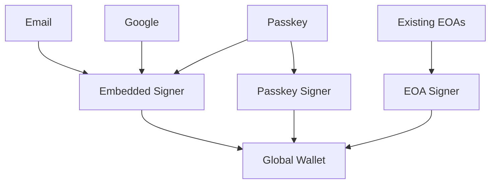

The Sophon Global Account utilizes native account abstraction, creating smart contract wallets for users, offering enhanced security and flexibility compared to traditional Externally Owned Accounts (EOAs).

Key Features:

- **Smart Contract Wallets**: Each user receives a smart contract wallet upon onboarding.
- **EOA Signers**: Users can authenticate using EOAs derived from their chosen login methods.
- **Gasless Transactions**: Transactions can be sponsored, eliminating the need for users to hold native tokens.
- **Session Keys**: Enable temporary permissions for specific actions or dApps.
- **Wallet Linking**: Users can link multiple wallets for unified access across dApps.

## Live demos

<CardGroup cols={2}>

<Card
  title="Try the Sophon Global Account with Reown AppKit"
  icon="code"
  href="https://sophon-account-eip-6963-appkit.vercel.app/"
>
  Try the Sophon Global Account with Reown AppKit
</Card>

<Card
  title="Try the Sophon Global Account with RainbowKit"
  icon="code"
  href="https://sophon-account-eip-6963-rainbowkit-wagmi.vercel.app/"
>
  Try the Sophon Global Account with RainbowKit
</Card>

<Card
  title="Try the Sophon Global Account with Thirdweb"
  icon="code"
  href="https://sophon-account-eip-6963-thirdweb.vercel.app/"
>
  Try the Sophon Global Account with Thirdweb
</Card>

<Card
  title="Try the Sophon Global Account with ConnectKit"
  icon="code"
  href="https://sophon-account-eip-6963-connectkit.vercel.app/"
>
  Try the Sophon Global Account with ConnectKit
</Card>

</CardGroup>

## Architecture

To create a global account, the user needs to provide a login method. This can be an email, a social login (Google, Apple, etc.), a Passkey, or an existing EOA.

Each login method associated with the global account must, in turn, be associated with an embedded wallet signer in order to sign transactions.

These signers, along with passkeys or EOA signers, are then associated with a smart contract account deployed on the Sophon network.

